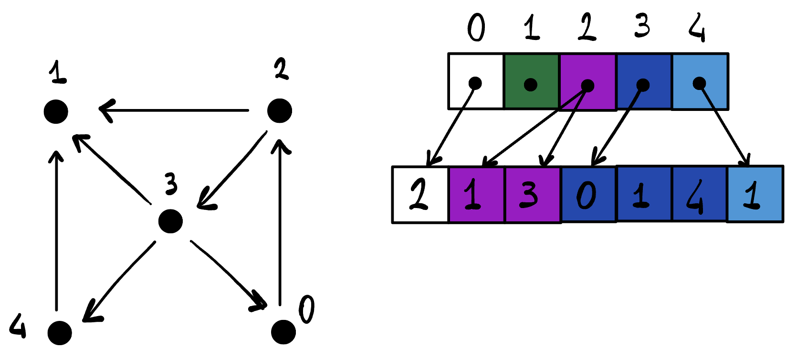

# Progetto di Architetture Parallele

Ricevuto il testo in data: 03 ottobre 2022

## Istruzioni per l'uso

Per la compilazione e l'esecuzione del programma, si utilizzano i seguenti comandi presenti nel MAKE file:
- `make cpp-compile` per compilare la versione serializzata dell'algoritmo
- `make cpp-run` per eseguire la versione serializzata dell'algoritmo
- `make cuda-compile` per compilare il runner di CUDA
- `make cuda-run` per eseguire il runner di CUDA

Per utilizzare i grafi discussi nella relazione, utilizzare il link fornito per scaricarli. Una volta scompattati, inserire il percorso all'interno del MakeFile nel comando corretto.

### Attenzione

Il runner (`scc_runner.cu`) esegue tutte le versioni dell'algoritmo, utilizzando il grafo fornito in input. Per eseguire solo le versioni desiderate, si commenti la porzione di codice apposita e si ricompili.

### Esempi di comandi

#### Compilazione della versione serializzata

```g++ -std=c++11 standalone.cpp -o ./build/standalone.exe```

#### Compilazione della versione parallela

```nvcc -Xcompiler /openmp -DDEBUG_FINAL=1 -DOMP_MIN_NODES=100000 -DWARMUP=0 ./cuda/scc_runner.cu -o ./build/scc.exe```

- **DEBUG_FINAL**: 0 per non far printare niente a video, 1 per visualizzare il risultato
- **OMP_MIN_NODES**: Numero di nodi necessario per attivare l'uso di OpenMP
- **WARMUP**: parametro usato per la raccolta dei tempi di esecuzione. Corrisponde al numero di esecuzioni successive di cui non viene salvata la durata.

#### Esecuzione della versione serializzata

```./build/standalone.exe F:/network-benchmark/final/twitter.txt```

Il parametro è la rete da fornire in input

#### Esecuzione della versione parallela

```./build/scc.exe F:/network-benchmark/final/twitter.txt 1```

I parametri sono rispettivamente:
- Rete da fornire in input
- Numero di esecuzioni da fare per ogni versione (senza considerare il parametro WARMUP)

## Richiesta del problema

Richiamo alcune **definizioni** preliminari:
  - 1 grafo diretto: G(V,E) con V insieme dei nodi, con E insieme di archi
  - 1 SCC di G: 1 qualsiasi insieme S (massimale con almeno 2 nodi) tale che per ogni coppia di nodi (x,y) in SCC esiste sempre un cammino diretto
  - Dato 1 insieme di nodi S, prec(S) = { n | n in V-S tale che esiste un arco (n,m) per almeno un qualsiasi nodo m in S }. Quindi prec(S) è l'insieme di tutti i nodi esterni all'insieme S che hanno almeno un arco connesso ad un nodo di S.

Il problema da risolvere in CUDA è il seguente: \
Dato un grafo G(V,E) e un insieme di nodi U  (un qualsiasi sottoinsieme di V),
determinare se esiste almeno una SCC  S del grafo tale che S è sottoinsieme di U
e nessun elemento di prec(S) appartiene a U.

## Vincoli da rispettare

Svolgerlo in CUDA e, opzionalmente, anche in CUDA+OpenMP.

La implementazione dovrebbe essere in grado di gestire grafi di dimensioni arbitrariamente grandi,
nei limiti della memoria disponibile sulla GPU.

Provare ad iniziare, impostando una possibile soluzione, rappresentando i dati su GPU e le principali funzioni da implementare,  
per poi riparlarne prima di iniziare a scrivere codice.

È da ricordare che la data della discussione può essere diversa dagli appelli ufficiali. \
È necessario fissare un giorno e la soluzione (codice, relazione, risultati di esempi, ...) va inviata almeno 10 giorni prima della data dell'orale.
  
## Input
  - V = Insieme di nodi
  - E = Insieme di archi
  - U = Un sottoinsieme di V

## Output
  - Almeno 1 SCC, che chiameremo S se esiste, tale che:
    - S sia un sottoinsieme di U
    - Nessun elemento di prec(S) appartiene a U

## Come rappresentare i dati

Per aiutarci, faremo uso del [sito](https://csacademy.com/app/graph_editor/) per rappresentare i grafi visualmente partendo da una lista di adiacenze.


Si può rappresentare un grafo (in questo caso non connesso e non pesato) G(V, E) dove:

    V = {1,2,3,4,5}
    E = { (1,4), (3,5), (2,4), (4,5), (1,3) }

Con 2 rappresentazioni:
  - La matrice delle adiacenze

            [ 0 0 1 1 0 ]
            [ 0 0 0 1 0 ]
        G = [ 1 0 0 0 1 ]
            [ 1 1 0 0 1 ]
            [ 0 0 1 1 0 ]

  - Le liste delle adiacenze.
  Saranno la nostra soluzione per quanto riguarda come rappresentare i dati.

        1 = [ 3 ]   2 = [ 4 ]   3 = [ 1 ]   4 = [ 1 ]   5 = [ 3 ]
            [ 4 ]                   [ 5 ]       [ 2 ]       [ 4 ]
                                                [ 5 ]

Bisogna capire quale delle 2 rappresentazioni può essere migliore per il nostro caso in CUDA.

Useremo le liste di adiacenza.
Verranno rappresentate da 2 vettori, dove dati degli archi (u,v):

1. Il primo vettore, con lunghezza |V|, contiene i nodi u in maniera univoca.
2. Il secondo vettore, con lunghezza |E|, contiene i nodi v di tutti gli archi e sarà ordinato in base all'ordine dei nodi u nel primo vettore.

I nodi v punteranno ai rispettivi nodi u e viceversa.

Per esempio:



## Algoritmo

Le operazioni identificate essere le più importanti sono le seguenti:
 * Generazione delle liste di adiacenza
 * Trovare le tutte SCC del grafo
 * Eliminare le SCC che non contengono nodi di U
 * Controllare che le SCC valide non abbiano nodi U che fanno parte dell'insieme prec(S)

Inizialmente si implementerà una versione che esegua queste operazioni in modo separato.

Possibili ottimizzazioni:
 * Si può evitare di evitare di calcolare le SCC in cui ci sono nodi che non fanno parte di U?
**Strutture dati aggiuntive**

* `removed`: vettore |V| che indica se un nodo potrebbe far parte o no di una SCC. Piuttosto di ricalcolare delle nuove liste senza un certo nodo, usiamo questo vettore di flag.
* `visited`: vettore |V| che indica se un nodo è stato visitato o no almeno da una visita forward o backward 
* `color`: Anche detto _range_, il vettore color ha lunghezza |V| e assegna ad ogni nodo un "colore" che identifica uno specifico sottografo. Due sottografi diversi hanno due colori diversi

_Opzionali_:
* `expanded`: vettore |V| che indica se un nodo è sgià stato attraversato o no